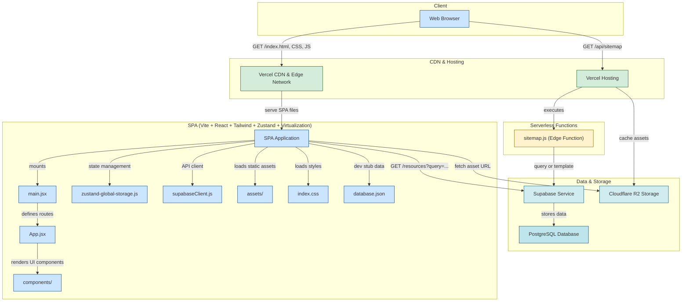

# Design Index

## About
I started this directory because I know what it’s like to be an average designer with big ideas and limited resources. I spent hours searching for high-quality mockups, fonts, illustrations, icons, and color tools — most of them scattered, overpriced, or hard to find.
But over time, I discovered a world of free and underrated resources that helped me improve my work dramatically.This site is my way of giving back — a curated collection of design tools, inspiration, and assets that are:

* Handpicked for Quality
* Mostly free or freemium
* Built to help you grow as a designer

Whether you're just starting out or already working on client projects, I hope these resources help you save time, learn faster, and create better work.

## Tech stack
*  - efficient processing of search queries.
*  - uses R2 object storage to store images
* __Zustand__ - managing global state
* __Tanstack Virtualization__ - efficient loading of elements
*   - website is built using react
*  - handles routing for the webpage
*  - simiplified styling on our webpage
*  - website is hosted on vercel

## Mermaid diagram

## Guidelines
> [!IMPORTANT]
> Please read this licence before contributing or cloning this github repo

> [!CAUTION]
> cloning of this repo might not give you expected results as the database is held in supabase

